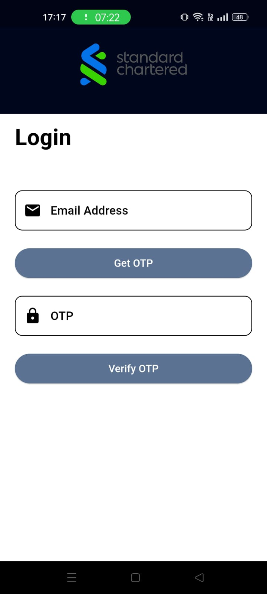

# Online-Video-KYC-SC
# App Flow

## 1. Launch Screen
- The app displays the Standard Chartered icon when launched.

## 2. Account Creation Screen
- After launching the app, the user is directed to a screen with a button to create an account for Know Your Customer (KYC) purposes.

## 3. Login Screen
- Upon tapping the button on the account creation screen, the user is navigated to a login page where they can enter their email ID.
- Additionally, there will be a mechanism for email verification, and an OTP (One-Time Password) is sent to the user's email for verification.

## 4. KYC Information Entry Screen
- Once the user successfully logs in, they are directed to a screen where they can enter their KYC information.
- This screen includes text fields for entering Aadhar card number, PAN card number, and date of birth (DOB).
- The user is required to upload images of their Aadhar card front and back, PAN card front and back, and a passport size photo.

## 5. Video KYC Screen
- After entering KYC information and uploading documents, the user proceeds to a video KYC (Know Your Customer) process.
- During the video KYC, the user is prompted to display their Aadhar card, PAN card, and passport size photo to the camera.
- Random snapshots of the user's face are taken to compare with their passport size photo and verify their identity.
- The images captured during the video KYC are verified with the backend database in real-time using Firebase.
- Upon successful verification, the border of the video KYC screen is highlighted with a green color, indicating completion.

## App Working:

- **Email Verification:** Upon entering the email ID, an OTP is sent to the user's email for verification.
- **Aadhar and PAN Verification:** The user-provided Aadhar card number is verified with the backend database in real-time using Firebase.
- **Passport Size Image Comparison:** The user's passport size photo is compared with the captured photo using OpenCV. If the images are below a certain threshold level and mean square error, they are considered identical.
- **Video KYC AI Proctoring:** During the video KYC process, the user's identity is verified by comparing the snapshots of their face with their passport size photo. Additionally, the images of documents displayed by the user are verified with the real-time Firebase database.
- **Blurred Image Detection:** We are developing a blurred image detection model using Support Vector Machine (SVM) to determine whether the image uploaded by the user is blurred or not.
The dataset used for blur image detection can be found [here](https://drive.google.com/drive/folders/1B9Lo0Vs5bpX6RiI2AJN2fpK1VcBDpeMz?usp=sharing).
- **Success Confirmation:** If all verification steps are successful, a green tick mark is displayed, indicating the successful completion of the video KYC process.

